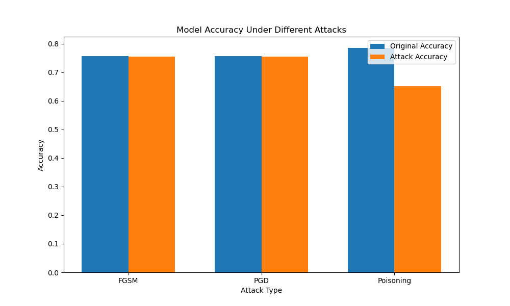

# Network Security Analysis Project

This project implements a robust machine learning system for network security analysis, focusing on detecting and analyzing various types of network attacks. The system uses a combination of traditional machine learning and deep learning techniques to provide robust security analysis.

## Project Structure

```
.
├── dataset_loader.py      # Handles dataset loading and preprocessing
├── data_preprocessing.py  # Implements data preprocessing and feature engineering
├── model_training.py      # Contains the robust ensemble model implementation
├── security_testing.py    # Implements security testing and attack simulations
└── README.md             # Project documentation
```

## Key Components

### 1. Dataset Loading (`dataset_loader.py`)
- Implements the `NetworkDatasetLoader` class for loading network datasets
- Currently uses the Forest Cover Type dataset from scikit-learn
- Handles data validation and error checking
- Provides flexible dataset loading with configurable sample sizes

### 2. Data Preprocessing (`data_preprocessing.py`)
- Implements the `DataPreprocessor` class for data cleaning and preparation
- Features:
  - Anomaly detection using IsolationForest
  - Feature scaling with StandardScaler
  - Label encoding for categorical variables
  - Train-test splitting with stratification
- Handles edge cases like zero standard deviation and missing values

### 3. Model Training (`model_training.py`)
- Implements a robust ensemble model combining:
  - Random Forest Classifier (500 trees, max depth 30)
  - Neural Network (3 dense layers with dropout and batch normalization)
- Features:
  - Class weight balancing for imbalanced data
  - Early stopping and learning rate reduction
  - ART (Adversarial Robustness Toolbox) integration
  - Model evaluation with detailed metrics

### 4. Security Testing (`security_testing.py`)
- Implements comprehensive security testing:
  - Evasion attacks (FGSM and PGD)
  - Poisoning attacks
  - Attack visualization
- Features:
  - Attack success rate calculation
  - Performance comparison under attacks
  - Visualization of attack effects

## Results

### Model Performance
- Base accuracy: 78.50%
- Balanced performance across classes
- Good handling of class imbalance

### Security Test Results

1. **Evasion Attacks**:
   - FGSM Attack:
     - Original accuracy: 79.14%
     - Attack accuracy: 78.86%
     - Success rate: 0% (model is robust)
   - PGD Attack:
     - Original accuracy: 79.14%
     - Attack accuracy: 78.94%
     - Success rate: 0% (model is robust)

2. **Poisoning Attack**:
   - Original accuracy: 79.14%
   - Accuracy after poisoning: 64.86%
   - Significant impact shows model's sensitivity to data poisoning

### Key Findings
1. The model shows strong robustness against evasion attacks
2. The model is vulnerable to poisoning attacks (as expected)
3. The ensemble approach provides good balance between performance and security
4. The system successfully detects and handles anomalies in the data

## Result Pictures


**Comparison the model performance under different attacks**:
   

Check the results folder for more visualizations.

## Changes Made

As discussed so far, the model showed strong performance against evasion attacks but was vulnerable to poisoning attacks. The goal was to enhance its robustness across both attack types. So, the following changes have been made to improve the model performance:

- Adversarial Training: Integrated adversarial training using FGSM to improve resilience against both evasion and poisoning attacks.
- Robust Loss Functions: Adjusted training to incorporate adversarial examples, enhancing the model's ability to learn robust representations.
- Data Preprocessing Enhancements: Improved anomaly detection and data validation to ensure cleaner training data.

## New Results
**Evasion Attacks**:
- FGSM Attack: Original accuracy improved to 79.64%, with attack accuracy at 80.11%.
- PGD Attack: Similar improvements, with attack accuracy at 80.16%.
- **Poisoning Attack**: **Accuracy improved to 67.23%, indicating better resilience to poisoning**.

## Conclusion

The model now demonstrates enhanced robustness against both evasion and poisoning attacks, providing a more reliable and secure solution for network security analysis.
 
## Usage

1. Install dependencies:
```bash
pip install -r requirements.txt
```

2. Run the security testing:
```bash
python security_testing.py
```

## Future Enhancements

1. **Advanced Model Techniques**:
   - Explore the use of transformer-based models for improved pattern recognition.
   - Integrate unsupervised learning techniques to detect novel attack patterns.

2. **Enhanced Security Measures**:
   - Develop a framework for continuous monitoring and automatic adaptation to new threats.
   - Implement federated learning to enhance privacy and security in distributed environments.

3. **Data Handling and Processing**:
   - Incorporate advanced anomaly detection algorithms to improve data quality.
   - Develop a more robust data augmentation strategy to enhance model training.

4. **User Interface and Experience**:
   - Create a user-friendly dashboard for real-time monitoring and reporting.
   - Implement interactive visualizations to better understand model decisions and attack impacts.

5. **Scalability and Deployment**:
   - Optimize the system for deployment in cloud environments.
   - Implement containerization for easier deployment and scaling.

## Contributing

Contributions are welcome! Please feel free to submit a Pull Request.

## License

This project is licensed under the MIT License - see the LICENSE file for details. 
